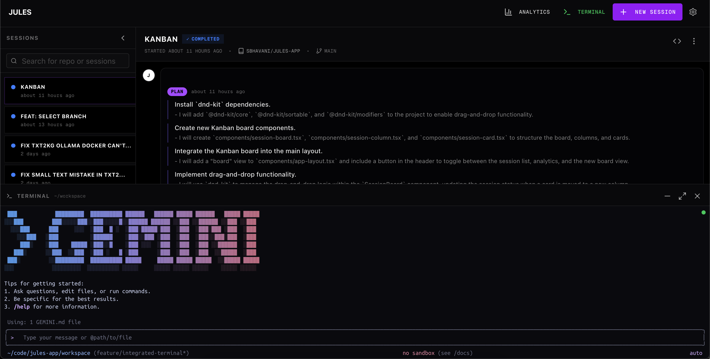

# Jules UI


**A powerful, self-hosted workspace for Google's Jules AI agent.** Transform standard agent interactions into an engineering command center with live code diffs, real-time activity monitoring, session analytics, and comprehensive terminal output inspection.

## ✨ Key Features

- 🔄 **Real-Time Updates** - Live activity feed with auto-polling
- 📊 **Code Diff Viewer** - Visualize git patches and changes instantly
- 💻 **Integrated Terminal** - Full web-based terminal with local machine access
- 📈 **Analytics Dashboard** - Track session metrics and trends
- 🔍 **Smart Search** - Find sessions by repository or title
- 📱 **Mobile-First** - Fully responsive design
- 🔒 **Secure** - Container isolation and API keys stored locally

## 🚀 Quick Start

**Prerequisites:** Node.js 18+, Jules API key from [jules.google.com](https://jules.google.com), and a connected GitHub repository.

### Option 1: Standalone Mode

Run just the Next.js app without the terminal server:

```bash
# Clone and install
git clone <your-repo-url>
cd jules-ui
npm install

# Start development server
npm run dev
```

Open [http://localhost:3000](http://localhost:3000) - the Terminal button will be visible but show setup instructions when clicked.

**To hide the Terminal button completely**, add to `.env.local`:

```bash
NEXT_PUBLIC_DISABLE_TERMINAL=true
```

### Option 2: With Docker Compose (Recommended)

Run both the Next.js app AND the terminal server together:

```bash
# Clone and install
git clone <your-repo-url>
cd jules-ui

# Configure your repository path (optional)
cp deploy/.env.local.example .env.local
# Edit .env.local and set REPO_PATH=/path/to/your/repo

# (Optional) Configure custom base image for terminal
# export TERMINAL_BASE_IMAGE=ubuntu:22.04

# Start all services (frontend + terminal server)
docker-compose -f deploy/docker-compose.yml up
```

Open [http://localhost:3002](http://localhost:3002) - the Terminal will connect automatically.

**Note:** Uses port 3002 to avoid conflicts with other services (like Dokploy on 3000).

### Option 3: Run Services Independently

Run the terminal server and Next.js app separately (useful for development):

```bash
# Terminal 1: Start the terminal server
cd terminal-server
npm install
npm start

# Terminal 2: Start the Next.js app
npm install
npm run dev
```

Open [http://localhost:3000](http://localhost:3000) - the Terminal will connect to the server on port 8080.

**Note:** Your Jules API key is stored securely in browser localStorage. See [docs/TERMINAL.md](docs/TERMINAL.md) for detailed terminal setup and usage.

## 📸 More Screenshots


_Integrated Terminal - Full web-based terminal with real-time command execution and output_


_Analytics Dashboard - Track session success rates, duration, and activity volume_

## 🛠️ Tech Stack

**Frontend:** [Next.js 16](https://nextjs.org/), [TypeScript](https://www.typescriptlang.org/), [Tailwind CSS](https://tailwindcss.com/), [shadcn/ui](https://ui.shadcn.com/), [xterm.js](https://xtermjs.org/)

**Terminal Server:** [Node.js](https://nodejs.org/), [Socket.io](https://socket.io/), [node-pty](https://github.com/microsoft/node-pty)

- **Base Image:** `nvcr.io/nvidia/pytorch:25.11-py3` (Configurable)
- **Pre-installed Tools:** `gemini-cli`, `python3`, `git`, `bash`

**Infrastructure:** [Docker](https://www.docker.com/), [Docker Compose](https://docs.docker.com/compose/)

## 🔧 Development

```bash
npm run dev      # Start dev server
npm run build    # Build for production
npm run lint     # Run linter
npm test         # Run tests
```

## 📚 API Integration

Integrates with Jules API (`https://jules.googleapis.com/v1alpha`) for session management, activity streaming, and real-time updates. See [developers.google.com/jules/api](https://developers.google.com/jules/api) for full documentation.

## 🤝 Contributing

Contributions welcome! Feel free to submit a Pull Request.

## 📄 License

MIT License - see LICENSE file for details.

---

Built with ❤️ for the Jules community
